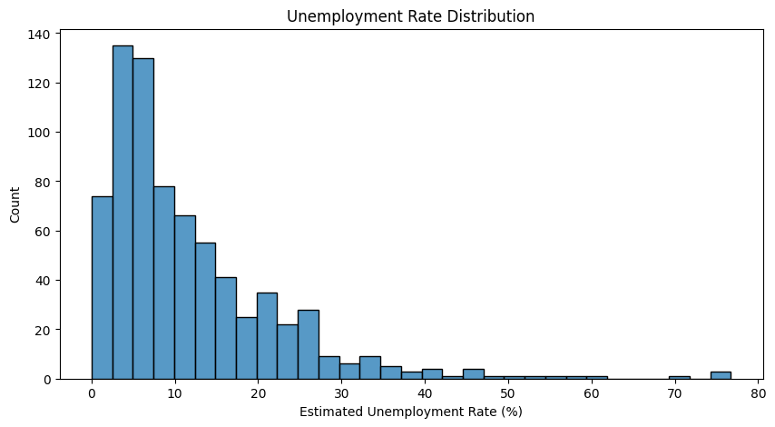
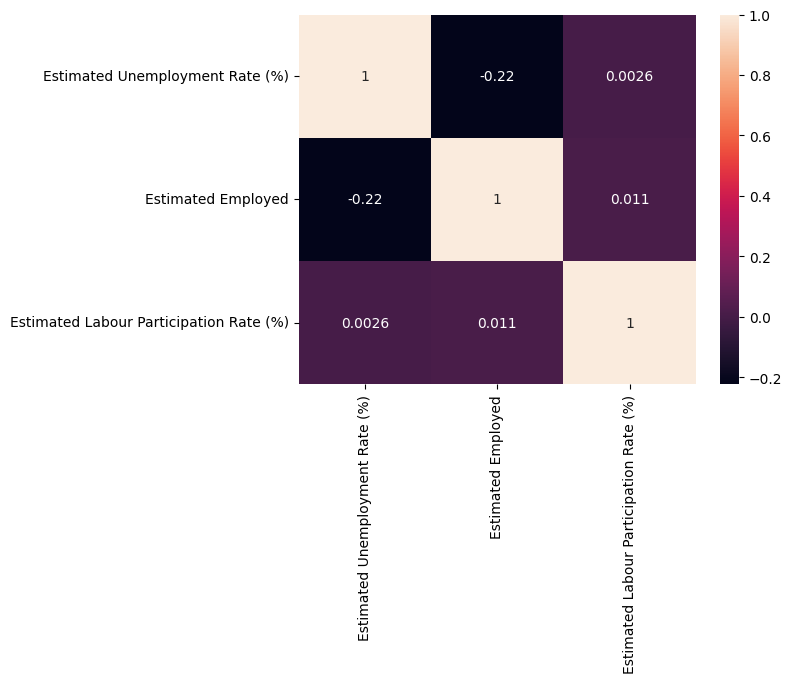

# CodeAlpha_Unemployment_Analysis
# Unemployment Analysis with Python

This project analyzes unemployment trends in India using Python and data visualization techniques.

## Technologies Used
- Python
- Pandas
- Matplotlib
- Seaborn

## Features
- Data cleaning and preprocessing
- Unemployment rate analysis
- Region-wise unemployment visualization
- Histogram distribution analysis
- Heatmap correlation analysis

## Output Screenshots

### Histogram

### Region-wise Analysis

### Heatmap

## Insights
- Some regions have higher unemployment rates.
- Data visualization helps identify unemployment trends clearly.
- Correlation analysis helps understand relationships between different factors.

## Conclusion
This project demonstrates how Python libraries can be used for unemployment data analysis and visualization.
